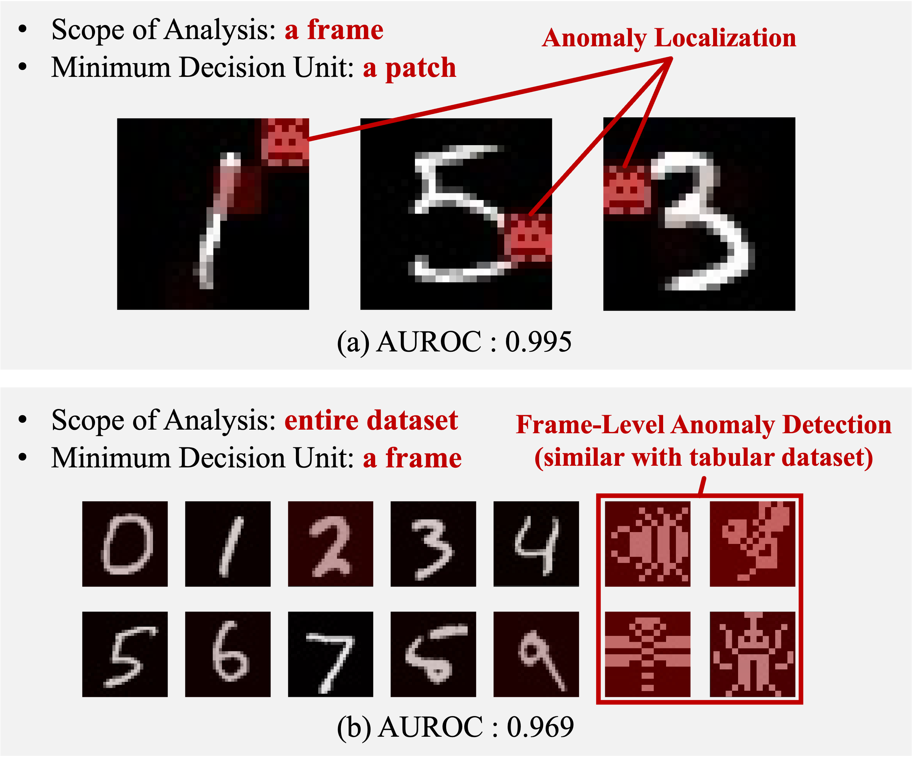
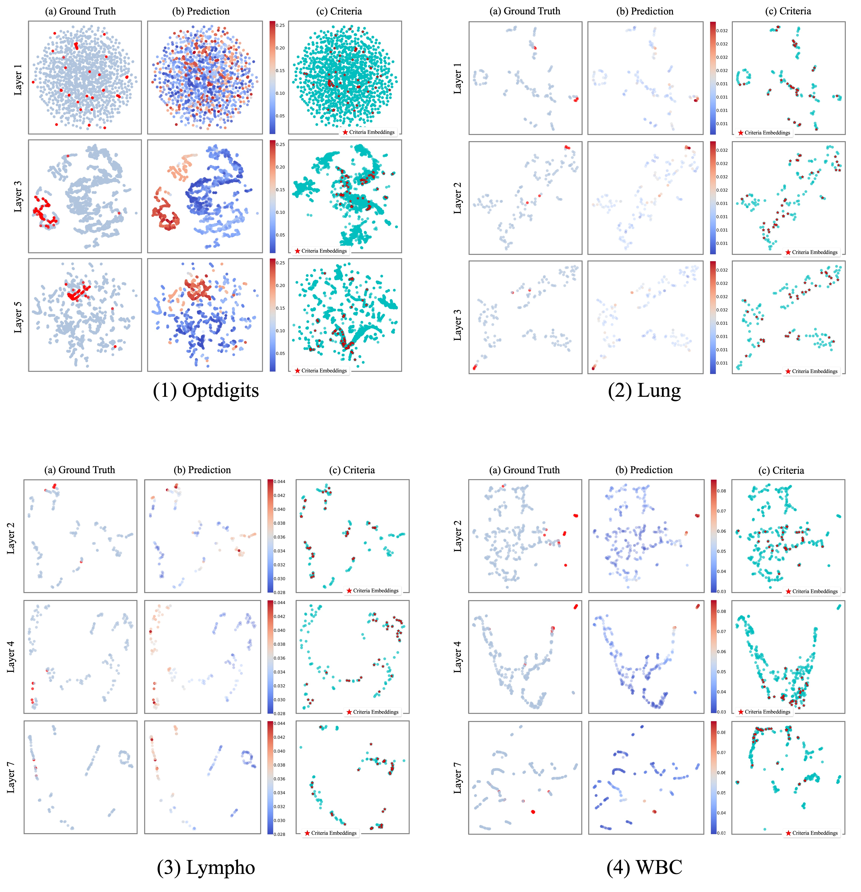

# TransPAD: Transformer for Point Anomaly Detection

This repository is for CIKM 2024 paper **"Transformer for Point Anomaly Detection"**.

## Paper Overview

In data analysis, unsupervised anomaly detection holds an important position for identifying statistical outliers that signify atypical behavior, erroneous readings, or interesting patterns across data.
The Transformer model [^1], known for its ability to capture dependencies within sequences, has revolutionized areas such as text and image data analysis.
However, its potential for tabular data, where sequence dependencies are not inherently present, remains underexplored.

In this paper, we introduce a novel Transformer-based AutoEncoder framework, _TransPAD_ (Transformer for Point Anomaly Detection).
Our method captures interdependencies across entire datasets, addressing the challenges posed with non-sequential, tabular data.
It incorporates unique random and criteria sampling strategies for effective training and anomaly identification, and avoids the common pitfall of trivial generalization that affects many conventional methods.
By leveraging an attention weight-based anomaly scoring system, _TransPAD_ offers a more precise approach to detect anomalies.

## Supplementary Experimental Results

<figure>

    <figcaption>이것은 프로젝트의 주요 이미지입니다.</figcaption>
</figure>

As shown in Figure 1-(a), The paper demonstrates that anomaly localization can be achieved by utilizing the Transformer’s attention weights as anomaly scores. Additionally, it presents in the preliminaries that frame-level anomaly detection, such as anomaly detection in tabular datasets, is possible using a novel approach called random/criteria sampler (Figure 1-(b)).

In the experiments, TransPAD was compared against existing anomaly detection methods across 10 benchmark tabular datasets. The results showed that TransPAD achieved up to a 24% improvement in AUROC (Area Under the Receiver Operating Characteristic Curve) compared to RDP (Random Distance Prediction) [^2], which was the best-performing method among the existing unsupervised point anomaly detection methods.

Moreover, to understand the prediction patterns and mechanisms of the model in the embedding space, UMAP (Uniform Manifold Approximation and Projection) [^3] was used to visualize the data embeddings at each encoder layer of TransPAD in a two-dimensional space. Additional visualization results are shared in this repository (Figure 2).

### References

[^1]: Ashish Vaswani, Noam Shazeer, Niki Parmar, Jakob Uszkoreit, Llion Jones, Aidan N Gomez, Łukasz Kaiser, and Illia Polosukhin. 2017. Attention is all you need. Advances in neural information processing systems, 30.
[^2]: Hu Wang, Guansong Pang, Chunhua Shen, and Congbo Ma. 2019. Unsupervised representation learning by predicting random distances. arXiv preprint arXiv:1912.12186.
[^3]: Leland McInnes, John Healy, and James Melville. 1802. Umap: uniform manifold approximation and projection for dimension reduction. arxiv 2018. arXiv preprint arXiv:1802.03426.
